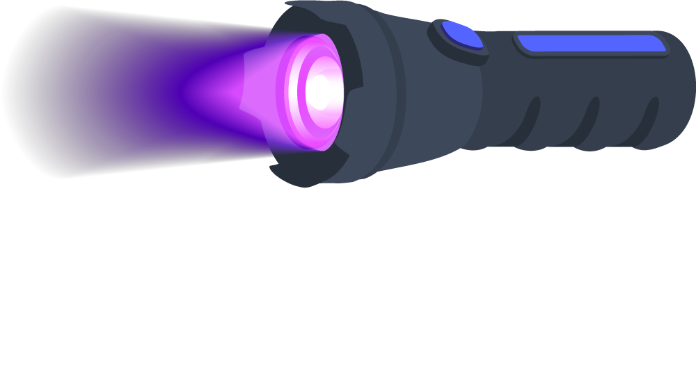

<p align="center">
  
</p>

# Blacklight

Blacklight has two separate phases for Codex, Claude Code, Cursor, and Antigravity CLI artifacts: **Scout** performs endpoint triage; **Session Analysis** parses only the files you choose to download.

## Workflow

1. **Scout the endpoint.** Find candidate session artifacts without reading their bodies.
2. **Choose and download files.** Transfer only the artifacts you want to review.
3. **Analyze downloads.** Create ranked, redacted local reports.

> [!IMPORTANT]
> Blog detailing the project: https://specterops.io/blog/2026/08/12/blacklight-ai-agent-endpoint-artifacts/

## What is in this repository

| Directory | Purpose |
| --- | --- |
| `blacklight-scout/` | Endpoint-native Scout artifacts for bounded metadata triage and session-candidate discovery. |
| `blacklight/` | Python CLI that discovers, parses, prioritizes, and reports on downloaded sessions. |
| `blacklight-rules/` | Defender inventory, exposure review, and detection guidance for these artifacts. |

## Phase 1: Scout the endpoint

Scout performs bounded metadata and filesystem triage. It identifies configuration, rules, authentication metadata, and candidate session paths, but does not read session bodies or print credential/configuration values.

### Build Scout

Build the Windows and Linux matrix with Docker:

```powershell
.\blacklight-scout\build.ps1
```

```bash
./blacklight-scout/build.sh
```

Build the macOS library on macOS:

```bash
make -C blacklight-scout release-macos
```

Build products are written to `out/build/scout/`.

| Artifact | Platform | Use |
| --- | --- | --- |
| `ai_path_scout.x64.o` | Windows x64 | No-argument BOF filesystem-triage snapshot. |
| `ai_path_scout-windows-x64.exe` | Windows x64 | Native endpoint assessment executable. |
| `ai_path_scout-managed.exe` | Windows .NET Framework 4.7.2 | Managed endpoint assessment for Apollo. |
| `libai_path_scout.so` | Linux x64 | No-argument filesystem-triage library. |
| `libai_path_scout.dylib` | macOS | No-argument filesystem-triage library. |

### Use Scout

The BOF and POSIX libraries take no filters. Windows executables support tool filtering:

```bash
ai_path_scout-windows-x64.exe --include-tool codex
ai_path_scout-managed.exe --include-tool cursor
```

For artifact interfaces and runner-specific behavior, see the [Scout guide](blacklight-scout/README.md).

## Phase 2: Analyze selected downloads

Install the Python CLI on the analysis host. It requires Python 3.11+.

```bash
python3.11 -m pip install -e .
```

If `blacklight` is not on `PATH`, use `python3.11 -m blacklight`.

Run the CLI against any local directory containing selected JSONL or SQLite artifacts. Files may be flat, nested, renamed, or duplicated when their content has a recognized schema.

Scout ranks session artifacts by newest activity and size, and reports the recognized artifact volume. For a fast review, download the selected ranked JSONL/SQLite artifacts intact; use the reported total to decide whether to collect more. Scout output and reconstructed endpoint paths are not required: any selected local directory can be analyzed.

```bash
blacklight sessions ~/Downloads/HOST-001 \
  --run-id HOST-001 \
  --output-directory out/results/HOST-001/reports \
  --max-files 10000
```

Use `--tool <codex|claude|cursor|antigravity_cli>` only to resolve ambiguous evidence. Use `--include`, `--exclude`, `--max-files`, and `--max-file-size` to limit scope. Add `--json` for a machine-readable terminal summary.

Each run writes a `<RUN_ID>_Session_Report.json` and matching `.txt` report. They include parse health, ranked sessions, activity and response-capture metrics, redacted high-value indicator metadata, and exact source-file paths for deeper review. Blacklight does not run external secret scanners; pass selected source files to your approved workflow.

Review partial, unsupported, ambiguous, and failed input records in the report inventory. A file-limit result means discovery was intentionally bounded; it does not stop supported files from being analyzed.

## Documentation

| Guide | When to use it |
| --- | --- |
| [Architecture](docs/architecture.md) | Boundaries, data flow, and parsing limits. |
| [Defender Rules](blacklight-rules/README.md) | Inventory, exposure review, and detections. |

## Research and contributions

Blacklight pulled some artifact paths from the [Endpoint AI Agent Abuse
(EAA) technique catalog](https://github.com/0x4D31/endpoint-ai-agent-abuse/blob/main/techniques/index.md).
Contributions that improve endpoint visibility, evidence handling, or defensive
guidance are welcome through issues and pull requests.
